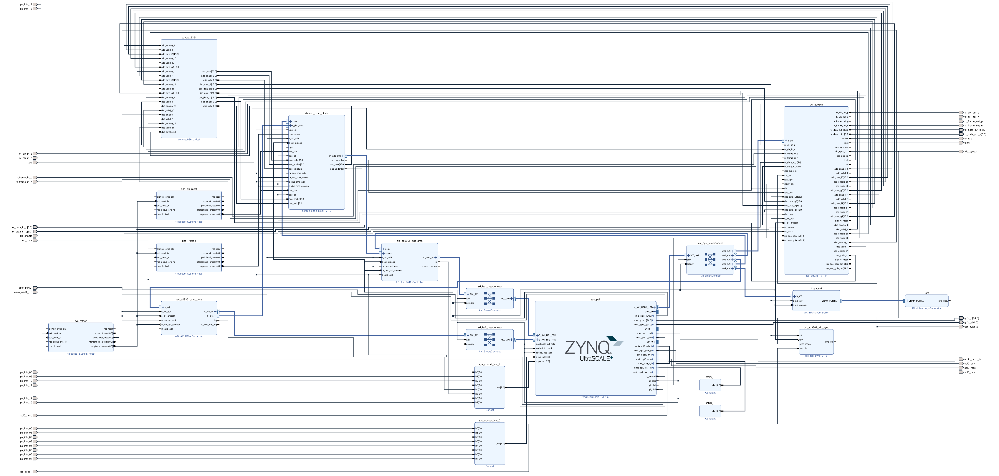
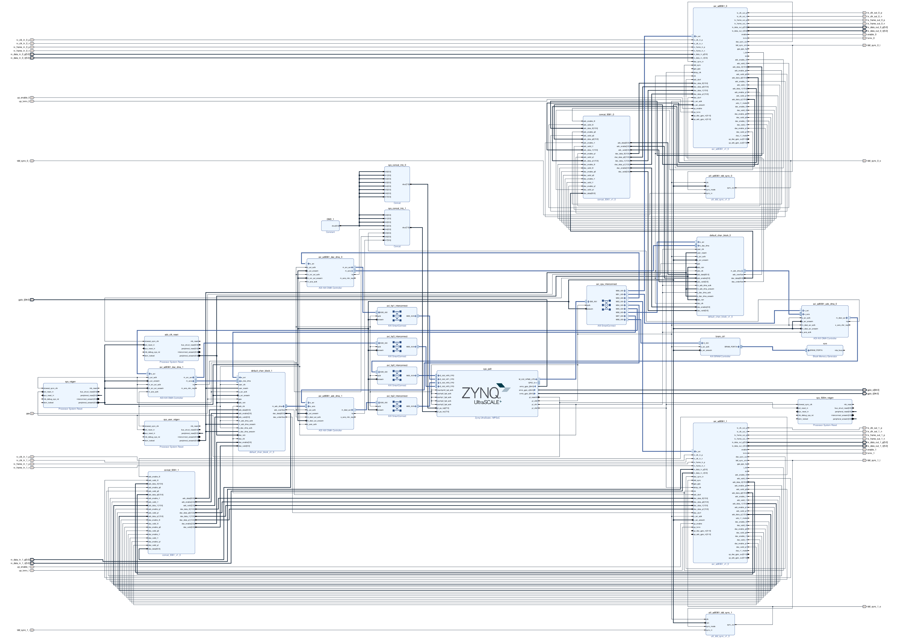

# hdl-default-chan

This repository is designed to be an OOT module to use in conjunction with [hdl-rwt](https://github.com/redwiretechnologies/hdl-rwt/tree/main).
It adds support for a version of our `default` project that incorporates a channelizer on the receive path.
It additionally adds support for dual transceiver version (for use with a radio such as our Carbon SDR) with independent channelizers on each receive path.

For issues with this repository, its documentation, or additional questions, please reach out to our lead FPGA engineer, Jonathan Ambrose, at (jambrose@redwiretechnologies.us).

---

# Requirements

This repository needs the requirements listed in the [hdl-rwt](https://github.com/redwiretechnologies/hdl-rwt/tree/main) README.    

---

# Building

Please note that while this repository implements both the `default-chan` and `default-4rx-chan` personalities, it does not provide a build target for `default-4rx-chan` as the Oxygen SDR does not support it. .
To add build targets for this personality, please additionally use  [hdl-compat-default-chan-carbon](https://github.com/redwiretechnologies/hdl-compat-default-chan-carbon).   
 
To use this repository in conjunction with [hdl-rwt](https://github.com/redwiretechnologies/hdl-rwt/tree/main), this repository must be checked out into the `oot` directory as shown below:
```
$ ls oot

hdl-default-chan/
``` 

After having done this, you must run `scripts/link_oot.sh` from the [hdl-rwt](https://github.com/redwiretechnologies/hdl-rwt/tree/main) repository. This will create hard symlinks from the files in your OOT modules to the directory structure within [hdl-rwt](https://github.com/redwiretechnologies/hdl-rwt/tree/main).   

After linking your files, running `scripts/build_projects.py` from [hdl-rwt](https://github.com/redwiretechnologies/hdl-rwt/tree/main) will add the additional personality for the Oxygen carrier board:
```
$ ./scripts/build_projects.py 

Select Personality(s) for Revision rev3 of Carrier oxygen
  0: default-chan
  1: blank
  2: default
  3: gr-iio
  4: All

Selection(s):  
```
 
# Utilization

The `utilization` directory stores information regarding the most recent set of builds using the projects in this repository. 
There are a set of Markdown files (starting with [utilization.md](utilization/utilization.md)) that organizes the information in an easy-to-navigate format. 
Additionally, full utilization reports can be viewed in the directory `utilization/utilization`. 
  
# Personalities

For clarification's sake on the nomenclature, a "personality" is a generic block diagram configuration that can/will be customized on a per board basis. A "project" is the single customized Vivado project for a combination of personality and board. 
 
## `default-chan`

The `default-chan` personality implements a version of our `default` project (described in the README of [hdl-rwt](https://github.com/redwiretechnologies/hdl-rwt/tree/main)) that supports the addition of a channelizer on the receive path. 

The current utilization numbers for this personality can be found [here](utilization/markdown/personalities/default-chan.md).
 

### Block Diagram

<center>


[](images/bd/default-chan.jpg)


</center>

## `default-4rx-chan`

The `default-4rx-chan` personality implements a version of our `default` project (described in the README of [hdl-rwt](https://github.com/redwiretechnologies/hdl-rwt/tree/main)) that supports a dual transceiver radio with the addition of a channelizer on the receive path. 

### Block Diagram

This block diagram uses the Carbon SDR as the intended platform.   

<center>


[](images/bd/default-4rx-chan.jpg)


</center>
